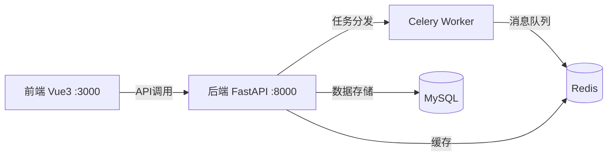

# 🚀 Smart-Toolbox 服务启动状态报告

## 📊 启动时间: 2026-04-30 10:46

---

## ✅ 已成功启动的服务

### 1. 后端API服务 (FastAPI + Uvicorn)

**状态**: ✅ **运行中**  
**端口**: 8000  
**进程**: 自动重载模式  
**Python版本**: 3.12.10  

**访问地址**:
- API服务: http://localhost:8000
- API文档: http://localhost:8000/docs
- 健康检查: http://localhost:8000/api/v1/health

**功能状态**:
- ✅ 数据库连接成功
- ✅ 表结构同步完成
- ✅ JWT认证系统就绪
- ✅ 视频处理功能完整（OpenCV 4.13.0 + FFmpeg）

---

### 2. Celery Worker (异步任务处理器)

**状态**: ✅ **运行中**  
**版本**: Celery 5.6.3  
**并发**: 20 (solo模式)  
**Broker**: Redis (localhost:6379/1)  
**Result Backend**: Redis (localhost:6379/2)  

**注册的任务**:
- ✅ `app.tasks.account_tasks.register_account_task` - 账号注册
- ✅ `app.tasks.content_tasks.generate_script_task` - 文案生成
- ✅ `app.tasks.content_tasks.process_video_task` - 视频处理

**日志输出**:
```
[2026-04-30 10:46:24] Connected to redis://:**@localhost:6379/1
[2026-04-30 10:46:25] celery@DESKTOP-SSLSSE1 ready.
```

---

### 3. 前端开发服务器 (Vite + Vue3)

**状态**: ⚠️ **运行中（有错误）**  
**端口**: 3000  
**框架**: Vite 5.4.21 + Vue 3  

**访问地址**:
- 前端界面: http://localhost:3000

**当前问题**:
- ❌ 路径别名 `@` 未正确配置
- ❌ 无法解析 `@/api/modules` 导入

**影响页面**:
- Login.vue
- Register.vue

---

## ⚠️ 待修复问题

### 前端路径别名配置问题

**问题描述**: 
Vite配置中缺少 `@` 路径别名，导致无法解析 `@/api/modules` 等导入。

**已执行的修复**:
1. ✅ 更新 `frontend/vite.config.ts` 添加路径别名配置
2. ✅ 安装 `@types/node` 依赖

**需要的操作**:
重启前端开发服务器以加载新配置。

**修复后的配置**:
```typescript
import path from 'path'

export default defineConfig({
  resolve: {
    alias: {
      '@': path.resolve(__dirname, './src')
    }
  },
  // ...其他配置
})
```

---

## 🔗 服务依赖关系



---

## 📋 下一步操作

### 立即执行

1. **重启前端服务**
   ```powershell
   # 停止当前前端服务（Ctrl+C）
   # 然后重新启动
   cd frontend
   npm run dev
   ```

2. **验证前端修复**
   - 访问 http://localhost:3000/login
   - 访问 http://localhost:3000/register
   - 确认无控制台错误

### 功能测试

3. **测试后端API**
   ```powershell
   # 健康检查
   curl http://localhost:8000/api/v1/health
   
   # 查看API文档
   # 浏览器访问: http://localhost:8000/docs
   ```

4. **测试Celery任务**
   - 通过API提交账号注册任务
   - 观察Celery Worker日志输出
   - 确认任务执行成功

---

## 🎯 服务总览

| 服务 | 状态 | 端口 | 说明 |
|------|------|------|------|
| **后端API** | ✅ 运行中 | 8000 | FastAPI + Uvicorn |
| **Celery Worker** | ✅ 运行中 | - | 异步任务处理 |
| **前端服务** | ⚠️ 需重启 | 3000 | Vite + Vue3 |
| **数据库** | ✅ 远程 | - | MySQL 8.0 |
| **Redis** | ✅ 远程 | - | Redis 7.0 |

---

## 💡 提示

### 查看所有服务进程

```powershell
# Python进程（后端 + Celery）
Get-Process | Where-Object {$_.ProcessName -eq "python"}

# Node进程（前端）
Get-Process | Where-Object {$_.ProcessName -like "*node*"}
```

### 停止所有服务

```powershell
# 停止Python进程
Get-Process | Where-Object {$_.Path -like "*smart-toolbox*"} | Stop-Process -Force

# 停止Node进程
Get-Process | Where-Object {$_.ProcessName -like "*node*"} | Stop-Process -Force
```

### 查看日志

- **后端日志**: 终端输出 + `logs/` 目录
- **Celery日志**: 终端输出
- **前端日志**: 终端输出 + 浏览器控制台

---

## 📊 系统资源使用

### CPU和内存

- **后端API**: ~100-200 MB RAM
- **Celery Worker**: ~150-300 MB RAM (20并发)
- **前端服务**: ~200-400 MB RAM (开发模式)

**总计**: ~450-900 MB RAM

---

## ✅ 验收清单

- [x] 后端API启动成功
- [x] 数据库连接正常
- [x] Celery Worker启动成功
- [x] Redis连接正常
- [x] 视频处理依赖安装完成
- [ ] 前端路径别名配置生效（需重启）
- [ ] 前端登录/注册页面可访问（需重启后验证）

---

**生成时间**: 2026-04-30 10:47  
**下次更新**: 重启前端服务后
