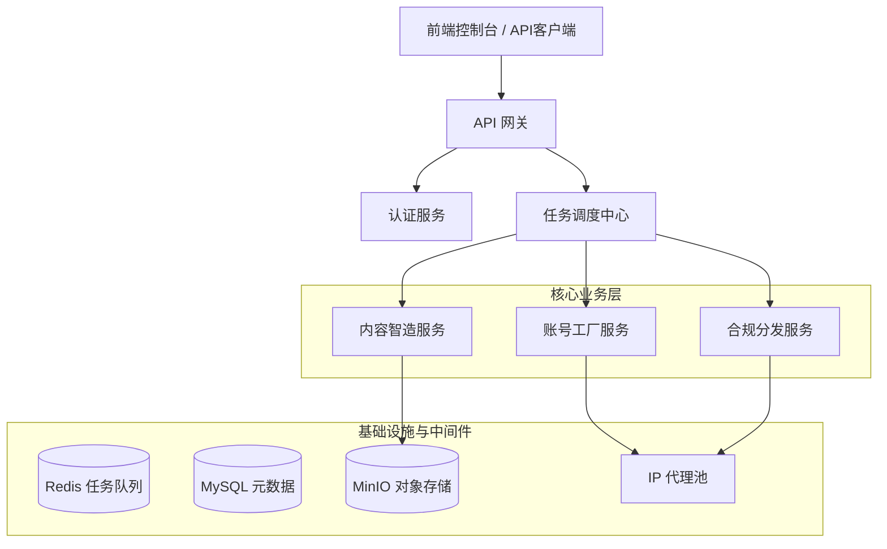

# Smart-Toolbox 技术架构设计文档

**版本号**: V1.0  
**状态**: 初始设计  
**编制日期**: 2026年4月28日  
**编制人**: 资深技术架构师 (AI Assistant)

---

## 1. 总体架构设计

Smart-Toolbox 采用 **微服务 + 事件驱动** 的分布式架构，以应对高并发的视频处理任务和复杂的 RPA 自动化流程。

### 1.1 架构图示 (Mermaid)

### 1.2 技术栈选型
*   **后端核心**: Python 3.11+ (利用其丰富的 AI 库与 RPA 生态)。
*   **Web 框架**: FastAPI (高性能异步接口)。
*   **RPA 引擎**: Playwright (支持多浏览器指纹隔离与异步操作)。
*   **AI 模型**: 
    *   LLM: DeepSeek-V3 / GPT-4o (文案生成)。
    *   CV: OpenCV + FFmpeg (视频处理)。
    *   OCR: PaddleOCR (验证码识别)。
*   **任务队列**: Celery + Redis (处理耗时的视频渲染与养号任务)。
*   **数据存储**: MySQL (业务数据), MinIO (视频/图片素材)。

---

## 2. 模块划分与目录结构

为了保持代码与文档的清晰度，我们将系统划分为三个核心子系统，并在 `docs` 目录下建立对应的子文件夹：

| 模块名称 | 对应文件夹 | 核心职责 |
| :--- | :--- | :--- |
| **智能账号工厂** | `docs/architecture/account_hub/` | 注册、养号、环境隔离、健康监控 |
| **爆款内容智造局** | `docs/architecture/content_studio/` | 脚本生成、视觉合成、智能去重 |
| **合规分发中心** | `docs/architecture/distribution_center/` | 违禁词筛查、格式转换、调度发布 |

---

## 3. 核心设计原则

1.  **拟人化优先 (Human-like First)**：所有 RPA 操作必须引入随机延迟与轨迹抖动，规避平台风控。
2.  **配置化规则 (Configurable Rules)**：各平台的爆款元素（如封面比例、违禁词库）需通过配置文件动态加载，无需重启服务。
3.  **幂等性设计 (Idempotency)**：分发任务需具备幂等性，防止因网络波动导致的重复发布。
4.  **安全隔离 (Security Isolation)**：每个账号任务必须在独立的容器或进程中运行，确保 Cookie 与指纹不交叉污染。

---

## 4. 详细模块架构索引

*   [智能账号工厂架构详情](./architecture/account_hub/README.md)
*   [爆款内容智造局架构详情](./architecture/content_studio/README.md)
*   [合规分发中心架构详情](./architecture/distribution_center/README.md)

---

**备注**：后续开发需严格遵循此架构文档，确保各模块间的接口契约一致性。
