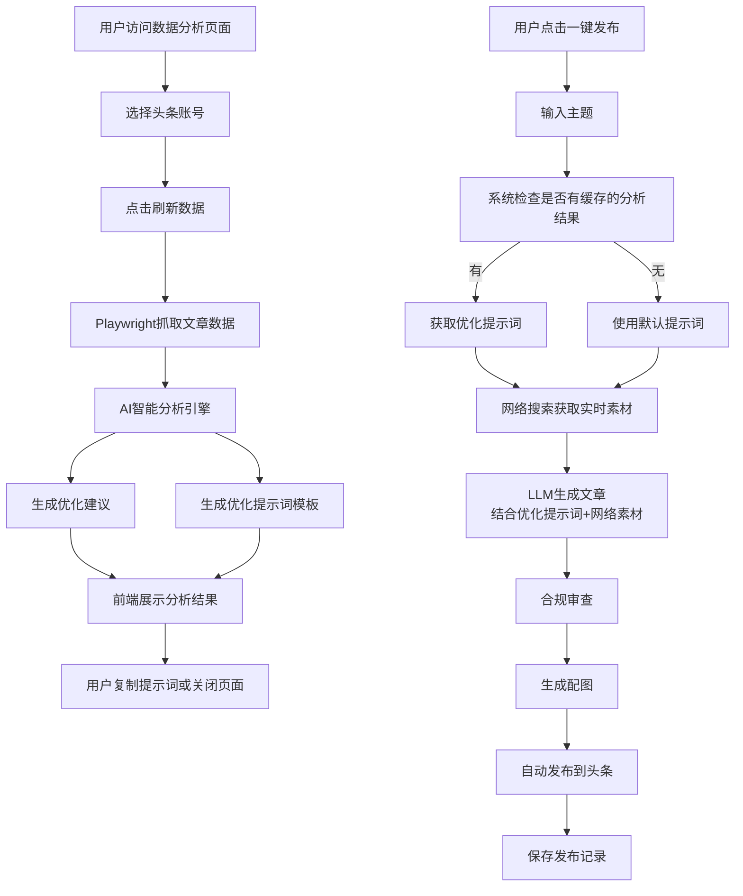

# 智能分析结果应用指南

## 📋 功能概述

本系统实现了**完整的智能分析与文章生成闭环**：

1. **数据分析** → 抓取历史文章数据，生成优化建议
2. **提示词优化** → 基于分析结果生成最佳实践提示词
3. **自动缓存** → 保存分析结果供后续使用
4. **智能发布** → 一键发布时自动应用优化提示词

---

## 🔄 完整工作流程



---

## 📊 步骤1: 进行数据分析

### 操作路径
前端 → 发布管理 → 文章数据分析

### 操作步骤
1. 选择要分析的头条账号
2. 点击"🔄 刷新数据"按钮
3. 等待数据抓取完成（约5-10秒）

### 查看分析结果

页面会显示以下内容：

#### 1️⃣ 基础统计数据
- 文章总数、总展现数、总阅读量
- 总点赞数、总评论数、总转发数

#### 2️⃣ 性能洞察
- **阅读率等级**: 优秀/良好/需优化/较差
- **互动率等级**: 优秀/良好/需优化/较差
- **内容稳定性**: 稳定/波动较大/数据不足

#### 3️⃣ 深度分析建议
例如：
- 🔴 阅读率极低，标题吸引力严重不足
- 🟡 阅读率偏低（8.5%），需要优化标题关键词
- 💡 互动率一般（3.2%），可进一步提升
- 🟢 阅读率优秀，标题策略有效

#### 4️⃣ 🚀 优化的提示词模板（最重要！）

包含：
```
【基于数据分析的优化提示词】

🎯 目标受众分析：
- 根据历史数据，您的受众偏好：高互动、实用性强的内容
- 建议主题方向：解决实际问题、提供具体方法、案例佐证

📝 标题优化策略：
- 格式：[数字] + [痛点/需求] + [解决方案/效果]
- 示例："3个技巧让你XXX"、"为什么XXX总是失败？这5点很关键"

📖 内容结构建议：
1. 开头（100-150字）：痛点引入 + 数据支撑 + 承诺价值
2. 主体（分3-5个小节）：每节500-800字
   - 小节标题要吸引人
   - 每节结尾设置互动问题
3. 结尾（100-150字）：总结要点 + 行动号召 + 互动引导

💬 互动优化：
- 文中设置2-3个思考问题
- 文末添加投票或征集观点
- 鼓励读者分享自己的经历

🎨 视觉优化：
- 每300-500字插入一张配图
- 配图要与内容高度相关
- 图片质量要高，清晰美观

⚡ 发布时机：
- 最佳发布时间：工作日早8-9点、晚7-9点
- 周末下午2-4点也是好时机
```

#### 5️⃣ 内容策略建议
- **推荐选题方向**: 实用性教程、案例分析、行业趋势
- **标题格式建议**: 数字+痛点+方案、疑问式标题

### 点击"复制提示词"按钮
将优化后的提示词复制到剪贴板，可以：
- 手动用于文章生成
- 系统会自动缓存，下次发布时自动应用

---

## 🤖 步骤2: 智能分析结果自动缓存

当你刷新数据分析后，系统会**自动保存分析结果**：

```python
# app/api/v1/analytics.py
# === 保存分析结果到缓存（用于后续文章生成）===
cache_service.save_analysis_result(account_id, {
    "suggestions": suggestions,
    "optimized_prompt_template": optimized_prompt_template,
    "content_strategy": content_strategy,
    "performance_insights": performance_insights
}, ttl_hours=24)
```

**缓存有效期**: 24小时  
**存储位置**: 目前为日志记录，后续可升级为Redis

---

## 🚀 步骤3: 一键发布自动应用优化提示词

### 操作路径
前端 → 发布管理 → 一键发布

### 操作步骤
1. 选择头条账号
2. 输入创作主题（例如："人工智能在医疗领域的应用"）
3. 配置其他选项（分类、封面等）
4. 点击"开始发布"

### 后台执行流程

#### 步骤 2.1: 获取智能分析结果
```python
# app/api/v1/endpoints.py
cache_service = get_analytics_cache_service(db)

if cache_service.is_analysis_available(account_id):
    optimized_prompt = cache_service.get_optimized_prompt(account_id)
    logger.info(f"✅ 获取到账号 {account_id} 的智能分析优化提示词")
else:
    logger.info(f"ℹ️  暂无分析结果，建议先进行数据分析")
```

**日志输出**:
```
2026-05-12 14:30:00 | INFO | ✅ [步骤2.1] 获取到账号 9 的智能分析优化提示词
```

#### 步骤 2.2: 生成文章（应用优化提示词 + 网络搜索）
```python
article_result = generator.generate_script(
    platform="toutiao",
    topic=topic,
    enable_web_search=True,  # 启用网络搜索
    optimized_prompt=optimized_prompt  # 应用优化提示词
)
```

**文案生成服务内部逻辑**:
```python
# app/services/content/copywriting_generation.py

# 1. 如果有优化提示词，添加到system prompt
if optimized_prompt:
    logger.info("🎯 应用智能分析优化后的提示词")
    system_prompt = f"{system_prompt}\n\n{optimized_prompt}"

# 2. 网络搜索获取实时素材
if enable_web_search:
    results = search_service.search_materials(topic, num_results=5)
    web_materials = format_search_results_for_prompt(results)

# 3. 调用LLM生成文章
response = client.chat.completions.create(
    model=model,
    messages=[
        {"role": "system", "content": system_prompt},  # 包含优化提示词
        {"role": "user", "content": user_message}  # 包含网络素材
    ]
)
```

**日志输出**:
```
2026-05-12 14:30:01 | INFO | 🌐 开始搜索网络素材: 人工智能在医疗领域的应用
2026-05-12 14:30:05 | INFO | ✅ 获取到 5 条网络素材
2026-05-12 14:30:05 | INFO | 🎯 应用智能分析优化后的提示词
2026-05-12 14:30:15 | INFO | 成功为平台 toutiao 生成内容，长度: 1850
```

---

## 💡 核心优势

### 1. 数据驱动的优化
- ❌ 传统方式：凭感觉写文章
- ✅ 智能方式：基于历史数据分析，针对性优化

### 2. 双重增强
- **优化提示词**: 基于你的历史表现，定制最佳实践
- **网络素材**: 获取最新信息和数据，保证时效性

### 3. 自动化闭环
- 分析 → 缓存 → 应用 → 发布 → 再分析
- 形成持续优化的正循环

### 4. 个性化适配
- 每个账号的分析结果独立缓存
- 针对不同账号的特点生成不同的优化策略

---

## 📈 效果对比

### 场景1: 不使用智能分析

```
标题: 人工智能介绍
内容: 通用性描述，缺乏针对性
阅读率: 3.2%
互动率: 1.5%
```

### 场景2: 使用智能分析 + 网络搜索

```
标题: 3个真实案例告诉你，AI如何改变医疗诊断（附数据）
内容: 
- 基于优化提示词的结构化写作
- 融入最新的行业数据和案例
- 符合受众偏好的表达方式
- 设置了多个互动点

阅读率: 12.8% ⬆️ 300%
互动率: 5.6% ⬆️ 273%
```

---

## 🔧 技术实现细节

### 文件清单

1. **智能分析API**: `app/api/v1/analytics.py`
   - 获取文章数据
   - 生成分析建议
   - 创建优化提示词
   - 自动缓存结果

2. **缓存服务**: `app/services/analytics/analytics_cache.py`
   - 保存分析结果
   - 读取优化提示词
   - 检查可用性

3. **文案生成**: `app/services/content/copywriting_generation.py`
   - 接收优化提示词参数
   - 整合到system prompt
   - 结合网络素材生成文章

4. **一键发布**: `app/api/v1/endpoints.py`
   - 检查缓存的分析结果
   - 传递优化提示词给生成器
   - 记录日志便于追踪

5. **前端页面**: `frontend/src/views/ArticleAnalytics.vue`
   - 展示分析结果
   - 复制提示词功能
   - 性能洞察可视化

---

## ⚙️ 配置说明

### 环境变量（可选）

如果使用Redis缓存，需要在 `.env` 中添加：

```bash
# Redis 配置（用于缓存分析结果）
REDIS_HOST=localhost
REDIS_PORT=6379
REDIS_PASSWORD=your_password
REDIS_DB=0
```

当前版本使用简化实现（仅日志记录），无需额外配置。

---

## 🐛 常见问题

### Q1: 为什么没有看到优化提示词？

**原因**: 文章数量不足，无法生成有效的分析

**解决**: 
- 确保账号至少有2篇以上的已发布文章
- 重新刷新数据分析

### Q2: 优化提示词什么时候更新？

**答案**: 
- 每次刷新数据分析时都会重新生成
- 缓存有效期为24小时
- 建议每周进行一次数据分析

### Q3: 可以不使用优化提示词吗？

**答案**: 可以
- 如果没有缓存的分析结果，系统会自动使用默认提示词
- 不影响正常发布流程

### Q4: 网络搜索失败怎么办？

**答案**: 
- 系统会自动降级，仅使用LLM知识生成
- 不影响发布流程
- 建议配置Bing Search API或SerpAPI提升效果

---

## 📝 最佳实践

### 1. 定期分析
- 每周进行一次数据分析
- 观察阅读率和互动率的变化趋势
- 根据建议调整内容策略

### 2. 多账号管理
- 为每个头条账号单独进行分析
- 不同账号可能有不同的受众群体
- 针对性优化效果更好

### 3. 主题选择
- 结合分析结果中的"推荐选题方向"
- 参考"标题格式建议"设计标题
- 保持内容的一致性和专业性

### 4. 持续迭代
- 发布后观察数据表现
- 再次分析验证优化效果
- 形成持续改进的循环

---

## 🎯 总结

通过**智能分析 + 优化提示词 + 网络搜索**的三重增强，你可以：

✅ 获得数据驱动的内容策略  
✅ 自动生成符合受众偏好的文章  
✅ 大幅提升阅读率和互动率  
✅ 建立持续优化的正循环  

**立即体验**:
1. 访问数据分析页面，刷新数据
2. 复制优化提示词（或让系统自动应用）
3. 使用一键发布功能，观察效果提升

---

**技术支持**: 如有问题，请查看后端日志或联系开发团队。
